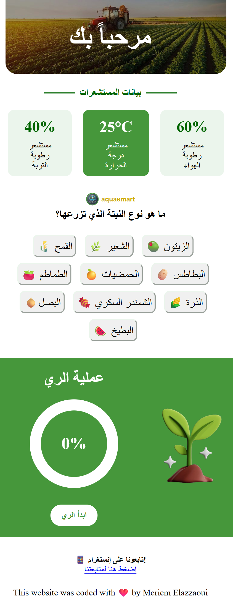

# AquaMonitor

## Overview

AquaMonitor is the **frontend website** I created as part of the **AquaSmart team project**, a smart irrigation system designed to help **Moroccan farmers reduce water usage and increase irrigation efficiency**.

## How It Works

The AquaMonitor website works as follows:

1. The dashboard displays **real-time sensor data** (simulated), including soil humidity, air humidity, and temperature.
2. The farmer selects the **type of plant** they are growing (currently 10 plant types).
3. JavaScript calculates the **exact amount of water needed** using a custom irrigation algorithm based on sensor data and plant type.
4. The farmer can **start irrigation** only after selecting a plant type; if no plant type is selected, a notification prompts the user to choose one. The farmer can also **pause and resume irrigation** at any time, while the system tracks progress until 100% completion.
5. **A notification** appears when irrigation is finished, indicating that the irrigation for today is complete and will resume the next day.

_Screenshot:_



_Live demo:_ [View on Netlify](https://rad-tartufo-6a5f31.netlify.app/)

---

## Features

- Mobile-friendly Arabic interface for Moroccan farmers
- Real-time sensor data display
- Dynamic water calculation per plant type and conditions
- Start/Stop irrigation with notifications
- Conditional logic to ensure proper usage
- User-focused design for farmers with low literacy or language limitations

---

## Tech Stack

- HTML
- CSS
- JavaScript (Vanilla JS)
- Frontend-only simulation (represents the website part of the team’s AquaSmart system)

---

## Future Improvements

- Connect the website to the **actual hardware prototype** for live control
- Add more **plant types** and corresponding water requirements
- Integrate **real IoT sensors** for live soil and air monitoring
- Add **historical data tracking** and analytics for farmers
- Improve **UI/UX** for easier interaction and accessibility

---

## Installation

1. Clone the repository:

```bash
git clone https://github.com/meriem837/aquamonitor.git

2. Open `index.html` in your browser.

---


```
